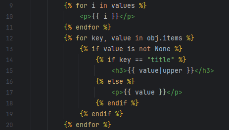

# Django Test

Простой Django проект с интеграцией PostgreSQL.

## Как работает
1. Меню с главной страницей и базой данных
2. Отображение, добавление, редактирование, удаление фильмов с БД

Скрины:

